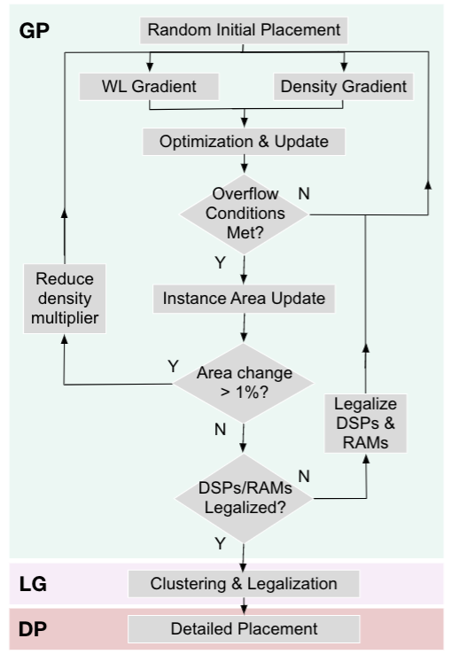
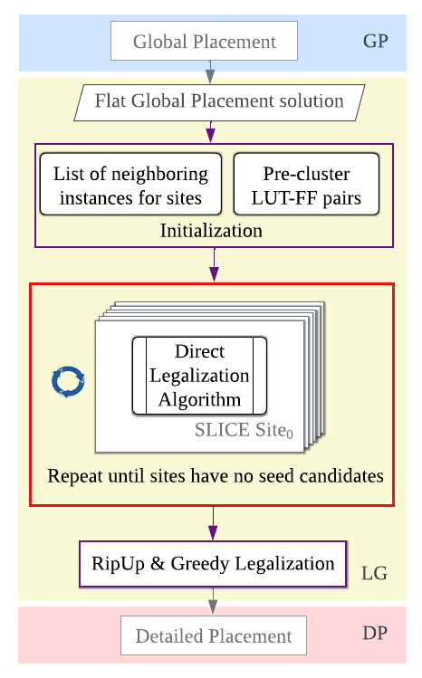

## Table of Contents

* [DREAMPlaceFPGA](#dreamplacefpga)
    - [FPGA Placement: Overview](#fpga_placement)
    - [Global Placer](#global_placer)
    - [Packer-Legalizer](#packer_legalizer)
    - [Performance](#performance)
    - [Target Architecture](#target_arch)
* [Developers](#developers)
* [Publications](#publications)
* [External Dependencies](#dependencies)
* [Cloning the Repository](#cloning)
* [Build Instructions](#build)
    - [To install Python dependency](#python_dependency)
    - [To install with Docker](#Docker)
    - [To Build](#build_dreamplacefpga)
    - [Cmake Options](#cmake)
* [Sample Benchmarks](#sample)
* [Running DREAMPlaceFPGA](#running)
* [JSON Configurations](#json)
* [Bug Report](#bug)
* [Copyright](#copyright)

# <a name="dreamplacefpga"></a>``DREAMPlaceFPGA``
``DREAMPlaceFPGA`` is an Open-Source GPU-Accelerated Placer for Large Scale Heterogeneous FPGAs using a Deep Learning Toolkit.

### <a name="fpga_placement"></a>FPGA Placement: An Overview
Placement is a crucial and computationally intensive step in the FPGA design flow that determines the physical locations of various heterogeneous instances in the design. In general, placement consists of three stages - global placement (GP), packing/clustering and legalization (LG), and detailed placement (DP).

* Stages in an FPGA Placement
<p align="center">
    
</p>

With a synthesized logic-mapped design netlist and the FPGA architecture description as inputs, the global placer obtains roughly legal locations for all the design instances. Based on the global placement (GP) solution, the packer clusters the FFs and LUTs to be placed on the corresponding sites. Then the legalizer assigns all the instances to their corresponding physical sites on the FPGA to obtain a legal placement.
A placement is legal when an instance occupies a site of the same type, and all instances can be routed with the limited routed resources available on an FPGA. The disruptive movement of instances to the fixed physical site locations during legalization results in quality degradation, and thus detailed placement (DP) further refines the legalized placement.

Among the various placement stages, the global placement and pack-legalize stages are accelerated in ``DREAMPlaceFPGA``.

### <a name="global_placer"></a>Global Placer
By leveraging the open-source ASIC placement framework, [DREAMPlace](https://github.com/limbo018/DREAMPlace), we build an open-source placement framework for FPGAs that is based on the [elfPlace](https://ieeexplore.ieee.org/document/8942075) algorithm.
The global placement flow in [``DREAMPlaceFPGA``](https://ieeexplore.ieee.org/document/9712562):
<p align="center">
  
</p>
The operators for wirelength, density, and instance area update are accelerated on a GPU.

### <a name="packer_legalizer"></a>Packer-Legalizer
Starting with a flat global placement solution, the [direct legalization](https://ieeexplore.ieee.org/document/8500228) (DL) algorithm allows for clustering (or) packing of LUTs and FFs, followed by legalization to their respective sites.
The packing-legalization flow in ``DREAMPlaceFPGA``:
<p align="center">
  
</p>

``DREAMPlaceFPGA`` enhances the DL algorithm and accelerates it on a GPU.

### <a name="performance"></a>Performance
``DREAMPlaceFPGA`` outperforms [elfPlace (GPU)](https://ieeexplore.ieee.org/document/9330804) by `19%` for global placementruntime.
On the [ISPD'2016 benchmark suite](http://www.ispd.cc/contests/16/FAQ.html), ``DREAMPlaceFPGA`` is `5.3×` faster for global placement, `2.2×` faster for packing-legalization and `2.4×` faster for overall placement than 16-thread [elfPlace (CPU)](https://ieeexplore.ieee.org/document/8942075), with a slight increase in (+0.6%) placement HPWL and (+0.9%) routed wirelength. For more details, please refer to the ['publications'](#publications).
> The runtime results vary based on the hardware used. The above mentioned results are based on a Linux machine with an Intel i9-7900 CPU (running at 3.30 GHz) and an NVIDIA Titan Xp (Pascal) GPU.

### <a name="target_arch"></a>Target Architecture
Support for the following architectures are available
#### Simplified Xilinx Ultrascale Architecture 
- The [ISPD'2016 benchmarks](http://www.ispd.cc/contests/16/FAQ.html), which employs a simplified Xilinx Ultrascale architecture, can be run on ``DREAMPlaceFPGA``.
- Interchange Format (IF) support is not available for this architecture.
#### Ultrascale+ Architecture
- Limited support is available for Ultrascale+ architecture GNL designs through the Interchange Format (IF). Please refer to [IF_README](./IFsupport/README.md) for more details.

> The [elfPlace (CPU)](thirdparty/elfPlace_LG_DP) binary is available to run the legalization and detailed placement stages, when ``DREAMPlaceFPGA`` is used to only run the global placement stage.
``DREAMPlaceFPGA`` runs on both CPU and GPU. If installed on a machine without GPU, multi-threaded CPU support is available.

## <a name="developers"></a>Developers

- Rachel Selina Rajarathnam, [UTDA](https://www.cerc.utexas.edu/utda), ECE Department, The University of Texas at Austin
- Zixuan Jiang, [UTDA](https://www.cerc.utexas.edu/utda), ECE Department, The University of Texas at Austin
- Zhili Xiong, [UTDA](https://www.cerc.utexas.edu/utda), ECE Department, The University of Texas at Austin

## <a name="publications"></a>Publications 

* Rachel Selina Rajarathnam, Mohamed Baker Alawieh, Zixuan Jiang, Mahesh A. Iyer, and [David Z. Pan](http://users.ece.utexas.edu/~dpan),  "**[``DREAMPlaceFPGA``: An Open-Source Analytical Placer for Large Scale Heterogeneous FPGAs using Deep-Learning Toolkit](https://ieeexplore.ieee.org/document/9712562)**", 
  *27th IEEE/ACM Asian and South Pacific Design Automation Conference (ASP-DAC)*, 2022.
* Rachel Selina Rajarathnam, Zixuan Jiang, Mahesh A. Iyer, and [David Z. Pan](http://users.ece.utexas.edu/~dpan), 
  "**[``DREAMPlaceFPGA-PL``: An Open-Source GPU-Accelerated Packer-Legalizer for Heterogeneous FPGAs](https://dl.acm.org/doi/abs/10.1145/3569052.3571881)**",  *ACM International Symposium on Physical Design (ISPD)*, 2023.

## <a name="dependencies"></a>External Dependencies

- Python 2.7 or Python 3.5/3.6/3.7

- [CMake](https://cmake.org) version 3.8.2 or later

- [Pytorch](https://pytorch.org/) 1.6/1.7/1.8
    - Other 1.0 versions may also work, but not tested.
    - **Version 2.0 or higher is not compatible!**

- [GCC](https://gcc.gnu.org/)
    - Recommend GCC 5.1 or later. 
    - Other compilers may also work, but not tested. 

- [cmdline](https://github.com/tanakh/cmdline)
    - a command line parser for C++

- [Flex](http://flex.sourceforge.net)
    - lexical analyzer employed in the bookshelf parser

- [Bison](https://www.gnu.org/software/bison)
    - parser generator employed in the bookshelf parser

- [Boost](https://www.boost.org)
    - Need to install and visible for linking

- [Limbo](https://github.com/limbo018/Limbo)
    - Integrated as a submodule: the bookshelf parser is modified for FPGAs.

- [Flute](https://doi.org/10.1109/TCAD.2007.907068)
    - Integrated as a submodule

- [CUB](https://github.com/NVlabs/cub)
    - Integrated as a git submodule

- [munkres-cpp](https://github.com/saebyn/munkres-cpp)
    - Integrated as a git submodule

- [CUDA 9.1 or later](https://developer.nvidia.com/cuda-toolkit) (Optional)
    - If installed and found, GPU acceleration will be enabled. 
    - Otherwise, only CPU implementation is enabled. 

- GPU architecture compatibility 6.0 or later (Optional)
    - Code has been tested on GPUs with compute compatibility 6.0, 7.0, and 7.5. 
    - Please check the [compatibility](https://developer.nvidia.com/cuda-gpus) of the GPU devices. 
    - The default compilation target is compatibility 6.0. This is the minimum requirement and lower compatibility is not supported for the GPU feature. 

- [Cairo](https://github.com/freedesktop/cairo) (Optional)
    - If installed and found, the plotting functions will be faster by using C/C++ implementation. 
    - Otherwise, python implementation is used. 

- [pycapnp](https://github.com/capnproto/pycapnp)
    - Required Python bindings for Interchange Format (IF) support.


## <a name="cloning"></a>Cloning the Repository

To pull git submodules in the root directory
```
git submodule init
git submodule update
```

Or alternatively, pull all the submodules when cloning the repository. 
```
git clone --recursive https://github.com/rachelselinar/DREAMPlaceFPGA.git
```

## <a name="build"></a>Build Instructions

### <a name="python_dependency"></a>To install Python dependency 

There is an aternative way to install DREAMPlaceFPGA using docker, if you want to use the docker, skip this step and goes to the next step, "To install with Docker"

At the root directory:
```
pip install -r requirements.txt 
```
> For example, if the repository was cloned in directory ***~/Downloads***, then the root directory is ***~/Downloads/DREAMPlaceFPGA***

> You can also use a [python virtual environment](https://docs.python.org/3/library/venv.html) to install all the required packages to run ``DREAMPlaceFPGA``

### <a name="Docker"></a>To install with Docker

You can use the Docker container to avoid building all the dependencies yourself.

1.  Install Docker on [Linux](https://docs.docker.com/install/).(Win and Mac are not tested)
2.  To enable the GPU features, install [NVIDIA-docker](https://github.com/NVIDIA/nvidia-docker); otherwise, skip this step.
3.  Get the docker image using one of the options
    Build the image locally
    ```
    docker build . --file Dockerfile --tag <username>/dreamplacefpga:1.0
    ```
    replace `<username>` with a username, for instance 'utda_placer'.
4.  Enter bash environment of the container.
    Mount the repo and all the Designs into the Docker, which allows the Docker container to directly access and modify these files

    To run on a Linux machine without GPU:
    ```
    docker run -it -v $(pwd):/DREAMPlaceFPGA <username>/dreamplacefpga:1.0 bash
    ```
    To run on a Linux machine with GPU: (Docker verified on NVIDIA GPUs with compute capability 6.1, 7.5, and 8.0)
    ```
    docker run --gpus 1 -it -v $(pwd):/DREAMPlaceFPGA <username>/dreamplacefpga:1.0 bash
    ```

    For example to run on a Linux machine without GPU:
    ```
    docker run -it -v $(pwd):/DREAMPlaceFPGA utda_placer/dreamplacefpga:1.0 bash
    ```
5.  Go to the `DREAMPlaceFPGA` directory in the Docker, which is the root directory of the project
    ```
    cd /DREAMPlaceFPGA
    ```


### <a name="build_dreamplacefpga"></a>To Build 

At the root directory, 
```
mkdir build 
cd build 
cmake .. -DCMAKE_INSTALL_PREFIX=path_to_root_dir
make
make install
```

if you are using the docker, using the following at the root directory,
 ```
rm -rf build
mkdir build 
cd build 
cmake .. -DCMAKE_INSTALL_PREFIX=/DREAMPlaceFPGA -DPYTHON_EXECUTABLE=$(which python)
make
make install
```

Third party submodules are automatically built except for [Boost](https://www.boost.org).

> For example,

> ***~/Downloads/DREAMPlaceFPGA:*** *mkdir build; cd build*

> ***~/Downloads/DREAMPlaceFPGA/build:***  *cmake . . -DCMAKE_INSTALL_PREFIX=~/Downloads/DREAMPlaceFPGA*

> ***~/Downloads/DREAMPlaceFPGA/build:*** *make; make install*

> The directory ***~/Downloads/DREAMPlaceFPGA/build*** is the install dir

When there are changes to packages or parser code, it is necessary to delete contents of ***build*** directory for a clean build and proper operation.
```
rm -r build
```
> For example,

> ***~/Downloads/DREAMPlaceFPGA:*** *rm -r build*

### <a name="cmake"></a>Cmake Options 

Here are the available options for CMake. 
- CMAKE_INSTALL_PREFIX: installation or root directory
    - Example ```cmake -DCMAKE_INSTALL_PREFIX=path/to/root/directory```
- CMAKE_CUDA_FLAGS: custom string for NVCC (default -gencode=arch=compute_60,code=sm_60)
    - Example ```cmake -DCMAKE_CUDA_FLAGS=-gencode=arch=compute_60,code=sm_60```
- CMAKE_CXX_ABI: 0|1 for the value of _GLIBCXX_USE_CXX11_ABI for C++ compiler, default is 0. 
    - Example ```cmake -DCMAKE_CXX_ABI=0```
    - It must be consistent with the _GLIBCXX_USE_CXX11_ABI for compling all the C++ dependencies, such as Boost and PyTorch. 
    - PyTorch in default is compiled with _GLIBCXX_USE_CXX11_ABI=0, but in a customized PyTorch environment, it might be compiled with _GLIBCXX_USE_CXX11_ABI=1. 


## <a name="sample"></a>Sample Benchmarks

``DREAMPlaceFPGA`` requires IO instances to be fixed and only accepts inputs in [Bookshelf](./benchmarks/sample_ispd2016_benchmarks/README) format.
- 4 sample benchmarks for *Xilinx Ultrascale Architecture* in bookshelf format with fixed IOs are provided. Refer to [ISPD'2016 contest](http://www.ispd.cc/contests/16/FAQ.html) for more information.
- 10 GNL designs based on *Xilinx Ultrascale+ Architecture* are provided. These benchmarks need to be converted from Interchange Format (IF) to bookshelf format before running ``DREAMPlaceFPGA``. Refer to [IF_README](./IFsupport/README.md) for more details.

The sample benchmarks and designs can be found in the [benchmarks](./benchmarks)  directory.

## <a name="running"></a>Running DREAMPlaceFPGA

Before running, ensure that all python dependent packages have been installed. 
Go to the ***root directory*** and run with JSON configuration file.  
```
python dreamplacefpga/Placer.py <benchmark>.json
```
> Run from ***~/Downloads/DREAMPlaceFPGA*** directory

For example:
```
python dreamplacefpga/Placer.py test/FPGA-example1.json
```
> ***~/Downloads/DREAMPlaceFPGA:*** *python dreamplacefpga/Placer.py test/FPGA-example1.json*

> If you are not using the GPU, change the gpu flag in the *.json file to 0.

Unit tests for some of the pytorch operators are provided. For instance, to run unit test for hpwl, use the below command:
```
python unitest/ops/hpwl_unitest.py
```
> Note: If your machine does not have an NVIDIA GPU, set the '***gpu***' flag in JSON configuration file to '***0***' to run on CPU.

### <a name="json"></a>JSON Configurations

The most frequently used options in the JSON file are listed below. For the complete list of available options, please refer to [paramsFPGA.json](./dreamplacefpga/paramsFPGA.json). 

| JSON Parameter                   | Default                 | Description                                                                                                                                                       |
| -------------------------------- | ----------------------- | ----------------------------------------------------------------------------------------------------------------------------------------------------------------- |
| aux_input                        | required for bookshelf  | input .aux file                                                                                                                                                   |
| gpu                              | 1                       | enable GPU acceleration or run on CPU                                                                                                                             |
| num_threads                      | 8                       | number of CPU threads                                                                                                                                             |
| num_bins_x                       | 512                     | number of bins in horizontal direction                                                                                                                            |
| num_bins_y                       | 512                     | number of bins in vertical direction                                                                                                                              |
| global_place_stages              | required                | global placement configuration of each stage, a dictionary of {"num_bins_x", "num_bins_y", "iteration", "learning_rate"}, learning_rate is relative to bin size. *Note: The maximum number of iterations can be set using "iteration" and default value is 2000.*  |
| routability_opt_flag                   | 0                     | Set to enable routability optimization. *Note: If this flag is not set for large designs, it makes legalization very difficult.*                                                                                                                                    |
| gamma                            | 5.0                     | initial coefficient for log-sum-exp and weighted-average wirelength                                                                                               |
| random_seed                      | 1000                    | random seed                                                                                                                                                       |
| scale_factor                     | 0.0                     | scale factor to avoid numerical overflow; 0.0 means not set                                                                                                       |
| result_dir                       | results                 | result directory for output                                                                                                                                       |
| global_place_flag                | 1                       | whether to run global placement                                                                                                                                   |
| legalize_flag                    | 1                       | whether to run legalization on *DREAMPlaceFPGA* else legalization and detailed placement are run using elfPlace                                                   |
| dtype                            | float32                 | data type, float32 (or) float64                                                                                                                                   |
| plot_flag                        | 0                       | whether to plot solution or not (Increases runtime)                                                                                                               |
| deterministic_flag               | 1                       | Ensures reproducible run-to-run results (Slightly increases runtime)                                                                                             |

## <a name="bug"></a>Bug Report

Please report bugs to [rachelselina dot r at utexas dot edu](mailto:rachelselina.r@utexas.edu).

## <a name="copyright"></a>Copyright

This software is released under *BSD 3-Clause "New" or "Revised" License*. Please refer to [LICENSE](./LICENSE) for details.
